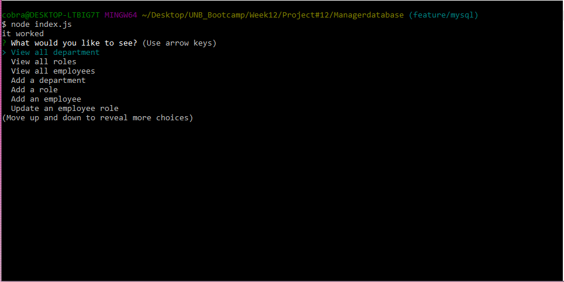

# Managerdatabase

## Description

This application is a database for an entreprise. Its made using MySql and inquirer.

## Installation

To run this application, you will need to run npm install in your terminal. Then you will need to install mysql on your computer. Once that is done, open your mysql terminal and run SOURCE schema.sql; then SOURCE seed.sql. Now you have the table on your side. After that you can run node index.js for your normal terminal and voila, you can access the information.

## Usage

To use this application, simply run node index.js after you install it. You will have prompt asking you what you want to do. Choose from the list and add, view or update the database.

## Credits

[Valerigionetnoel](https://github.com/Valerigionetnoel) you can email me [here](mailto:valeri.gionetnoel@gmail.com)

## License

Refer to license in repo for more information.